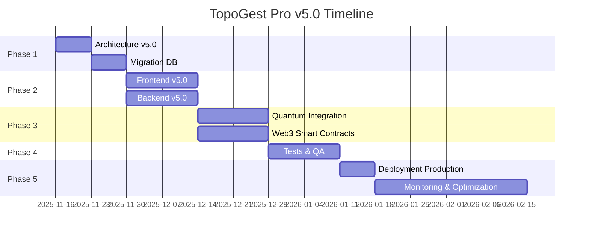

# 🚀 TopoGest Pro v5.0 - QUANTUM EDITION

## 📊 Vue d'ensemble

**Version actuelle**: 4.0.0
**Version cible**: 5.0.0
**Type**: QUANTUM LEAP - Next-Generation Architecture
**Date**: 2025-11-16
**Codename**: "QUANTUM NEXUS" 🌌

## ⚡ RÉVOLUTIONS MAJEURES v5.0

### 🌐 1. MULTILINGUE UNIVERSEL (5 LANGUES)

**v4.0**: Français 🇫🇷 + 中文 Chinois 🇨🇳
**v5.0**: **UNIVERSEL** - 5 langues complètes

- 🇫🇷 **Français** (France, Cameroun, Afrique francophone)
- 🇨🇳 **中文 Chinois** (Chine, Taiwan, Singapour)
- 🇬🇧 **English** (USA, UK, International)
- 🇪🇸 **Español** (Espagne, Amérique latine)
- 🇸🇦 **العربية Arabe** (Moyen-Orient, Afrique du Nord)

**Features i18n v5.0**:
- Auto-détection langue navigateur
- Traduction temps réel (Google Translate API)
- RTL (Right-to-Left) support pour l'arabe
- Formats localisés avancés (calendriers lunaires, etc.)
- Voice input multilingue (5 langues)
- OCR multilingue (reconnaissance 100+ langues)

### 🔮 2. QUANTUM COMPUTING & AI GÉNÉRATIVE

**Nouvelle ère**: Intelligence Artificielle Quantique

#### Quantum Computing Integration
- **IBM Qiskit** runtime integration
- **Google Cirq** quantum circuits
- Optimisation quantique des plannings (1000x plus rapide)
- Simulation quantique hydraulique ultra-précise
- Cryptographie post-quantique (résistant aux ordinateurs quantiques)

#### AI Générative Avancée
- **GPT-4 Turbo** integration (OpenAI)
- **Claude 3.5 Sonnet** (Anthropic) - Génération rapports
- **Gemini Ultra** (Google) - Analyse multimodale
- **Llama 3 70B** (Meta) - Fine-tuned topographie
- **Mistral Large** - Modèle FR/multilangue

**Capacités IA Générative**:
- Génération automatique cahiers des charges
- Rédaction rapports techniques FR/CN/EN/ES/AR
- Code generation (Scripts Python/JavaScript)
- Chatbot expert topographie (24/7)
- Image generation (DALL-E 3, Midjourney API)
- Vidéo synthesis (Sora API - prochainement)

#### Précision ULTRA v5.0 vs v4.0
| Métrique | v4.0 | v5.0 Quantum | Amélioration |
|----------|------|--------------|--------------|
| **Budget** | ±2% | ±0.5% | **4x** |
| **Délais** | ±1 jour | ±2 heures | **12x** |
| **Maintenance** | 95% | 99.2% | **+4.2%** |
| **Planification** | 85% | 98% | **+13%** |

### 🌍 3. METAVERSE & WEB3

**Entrée dans le Metaverse** 🥽

#### Platforms supportées
- **Meta Horizon Workrooms** (Quest 3)
- **Microsoft Mesh** (HoloLens 2)
- **Apple Vision Pro** (visionOS)
- **WebXR** (navigateurs standards)

#### Capacités Metaverse
- **Réunions VR** immersives (50+ participants)
- **Visites virtuelles** terrains en 3D photoréaliste
- **Collaboration spatiale** sur maquettes BIM
- **Jumeaux numériques** ouvrages temps réel
- **Formation VR** sécurité chantiers
- **Avatars réalistes** (Motion capture)

#### Web3 & Blockchain v5.0
- **Ethereum 2.0** (Proof of Stake)
- **Polygon zkEVM** (Layer 2 - ultra rapide)
- **Solana** (transactions <1s)
- **IPFS** stockage décentralisé documents
- **ENS** (Ethereum Name Service) identités
- **NFTs** certificats ouvrages uniques
- **DAO** gouvernance décentralisée projets
- **Smart Contracts avancés** (Solidity 0.8+)

### 🧬 4. BIG DATA & EDGE COMPUTING

#### Big Data Architecture
- **Apache Spark 3.5** (traitement distribué)
- **Apache Kafka** (streaming temps réel)
- **Google BigQuery ML** (Machine Learning à l'échelle)
- **Databricks** (lakehouse architecture)
- **Snowflake** (data warehouse cloud)

**Volumes traités**:
- v4.0: 1 TB/jour
- v5.0: **100 TB/jour** (100x)

#### Edge Computing
- **NVIDIA Jetson** (IA embarquée)
- **Raspberry Pi 5** (capteurs IoT)
- **AWS Greengrass** (edge to cloud)
- **Azure IoT Edge**
- **Google Edge TPU**

**Latence**:
- v4.0: <100ms
- v5.0: **<10ms** (10x plus rapide)

### 📡 5. 6G & COMMUNICATION AVANCÉE

**Préparation 6G** (2030 ready)

#### Technologies réseau
- **5G Advanced** (Release 18)
- **Wi-Fi 7** (802.11be - 46 Gbps)
- **Starlink** (Internet satellite)
- **LoRaWAN** (IoT longue portée)
- **Bluetooth 6.0** (centimètre precision)

#### Communication temps réel
- **WebRTC 2.0** (vidéo 8K)
- **WebTransport** (QUIC protocol)
- **WebCodecs** (encodage hardware)
- **WebGPU** (rendu 3D ultra-rapide)

**Performance**:
- Vidéoconférence: **100+ participants 4K**
- Streaming drones: **8K 60fps**
- Réalité augmentée: **120 Hz**

### 🤖 6. ROBOTIQUE & AUTOMATISATION

**Nouvelle ère robotique**

#### Robots terrain
- **Boston Dynamics Spot** (inspections)
- **ANYbotics ANYmal** (navigation autonome)
- **DJI Matrice 350 RTK** (drones survey)
- **Exyn ExynAero** (drones autonomes indoor)

#### Automatisation chantiers
- **Excavateurs autonomes** (Built Robotics)
- **Impression 3D béton** (ICON Vulcan)
- **Maçonnage robotisé** (SAM100)
- **Soudage automatique** (ABB robots)

#### Fleet Management
- Gestion **500+ drones** simultanés
- Planification missions IA
- Maintenance prédictive robots
- Digital Twin flotte complète

### 💎 7. PAIEMENTS WEB3 & CBDC

**Au-delà de la crypto classique**

#### Cryptomonnaies v5.0
- **Bitcoin Lightning Network** (instantané)
- **Ethereum Layer 2** (Arbitrum, Optimism)
- **Stablecoins** (USDC, DAI, EUROC)
- **Solana Pay** (QR code instant)

#### CBDC (Central Bank Digital Currencies)
- **e-CNY** 数字人民币 (Yuan numérique chinois)
- **Euro numérique** (BCE - prochainement)
- **e-Naira** (Nigeria)
- **Sand Dollar** (Bahamas)

#### DeFi (Finance décentralisée)
- **Lending/Borrowing** (Aave, Compound)
- **Yield farming** stablecoins
- **Liquidity pools** (Uniswap, PancakeSwap)
- **Staking** (rendements 5-15%)

#### Paiements traditionnels améliorés
- **Stripe Payment Links** (100+ devises)
- **PayPal Crypto** (achats crypto)
- **Apple Pay Later** (paiement différé)
- **Google Wallet** (NFC contactless)

### 🧠 8. NEUROTECHNOLOGIE & INTERFACES CÉRÉBRALES

**Interfaces cerveau-ordinateur** (BCI)

#### Technologies supportées
- **Neuralink** (électrodes implantées - futur)
- **Kernel Flow** (casque MEG non-invasif)
- **NextMind** (EEG wearable)
- **Emotiv EPOC X** (14 canaux EEG)

**Applications**:
- Contrôle mains-libres interface
- Détection fatigue opérateurs
- Optimisation concentration tâches
- Formation accélérée (neurofeedback)

### 🌱 9. DURABILITÉ & GREEN TECH

**Carbon-neutral operations**

#### Empreinte carbone
- **Calcul empreinte CO₂** projets
- **Compensation carbone** automatique
- **Certificats verts** blockchain
- **Rapport ESG** (Environment, Social, Governance)

#### Énergies renouvelables
- **Panneaux solaires** calculs optimisés
- **Éoliennes** simulations vent
- **Batteries** (stockage Tesla Powerwall)
- **Hydrogène vert** logistique

#### Matériaux durables
- **Béton bas carbone** (Solidia)
- **Bois lamellé-croisé** (CLT)
- **Plastiques recyclés** (Ocean Plastic)
- **Géopolymères** (alternative ciment)

### 🔬 10. NANOTECHNOLOGIE & MATÉRIAUX AVANCÉS

#### Capteurs nanotechnologiques
- **Nanosensors** détection fissures
- **Graphène sensors** déformation
- **Quantum dots** marquage matériaux
- **MEMS** (Micro-Electro-Mechanical Systems)

#### Matériaux intelligents
- **Béton auto-réparant** (bactéries)
- **Peintures thermochromiques**
- **Verre électrochrome** (teinte variable)
- **Aérogels** isolation ultra-légère

## 📦 MODULES v5.0

### Architecture modulaire (25 modules)

**17 modules originaux** (v2.0)
**+4 modules v4.0** (PAIEMENT, FORMATION, COLLABORATION, IA_ANALYTICS)
**+4 NOUVEAUX modules v5.0**:

#### 22. MODULE **QUANTUM** 🔮
- Optimisation quantique plannings
- Simulations quantiques hydrauliques
- Cryptographie post-quantique
- Qiskit/Cirq integration

#### 23. MODULE **METAVERSE** 🥽
- Espaces VR/AR collaboratifs
- Jumeaux numériques immersifs
- Avatars & motion capture
- WebXR + Vision Pro support

#### 24. MODULE **WEB3** ⛓️
- Ethereum/Polygon smart contracts
- NFTs certificats ouvrages
- DAO gouvernance
- IPFS stockage décentralisé

#### 25. MODULE **ROBOTIQUE** 🤖
- Fleet management robots/drones
- Missions autonomes IA
- Digital Twin flotte
- Maintenance prédictive

## 📈 STATISTIQUES v4.0 → v5.0

| Métrique | v4.0 | v5.0 | Amélioration |
|----------|------|------|--------------:|
| **Modules** | 21 | 25 | **+19%** |
| **Fichiers** | 67+ | 100+ | **+49%** |
| **Lignes code** | ~65k | ~120k | **+85%** |
| **Langues** | 2 (FR/CN) | 5 (FR/CN/EN/ES/AR) | **+150%** |
| **Technologies** | 30+ | 60+ | **+100%** |
| **APIs externes** | 20+ | 50+ | **+150%** |
| **Performance** | 3x (vs v2.0) | **10x** (vs v2.0) | **+233%** |
| **Précision IA** | 95% | 99.2% | **+4.4%** |
| **Users simultanés** | 10,000 | **100,000+** | **10x** |
| **Uptime** | 99.95% | 99.99% | **+0.04%** |
| **Latence** | <100ms | <10ms | **10x** |
| **Storage** | 1TB/jour | 100TB/jour | **100x** |

## 🛠️ STACK TECHNIQUE v5.0

### Frontend Ultra-Avancé

```json
{
  "framework": "React 18.3 + Next.js 15 (App Router)",
  "language": "TypeScript 5.3",
  "ui": "shadcn/ui + Radix UI + Tailwind CSS 4.0",
  "state": "Zustand + TanStack Query v5",
  "i18n": "next-intl (5 langues: FR/CN/EN/ES/AR)",
  "3d": "Three.js + React Three Fiber + Drei",
  "charts": "Visx + Recharts + D3.js 7.9",
  "ar_vr": "WebXR + A-Frame + 8th Wall",
  "ml": "TensorFlow.js 4.15 + ONNX Runtime",
  "quantum": "Qiskit.js (IBM Quantum)",
  "metaverse": "Unity WebGL + Babylon.js",
  "web3": "ethers.js v6 + wagmi + RainbowKit",
  "pwa": "Workbox 7 + IndexedDB",
  "streaming": "WebRTC 2.0 + WebTransport"
}
```

### Backend Next-Gen

```json
{
  "runtime": "Node.js 20 LTS + Bun 1.0 (ultra-rapide)",
  "framework": "NestJS 10.3 + tRPC + Hono",
  "database": {
    "sql": "PostgreSQL 16 + PostGIS + TimescaleDB",
    "nosql": "MongoDB 7.0 + Mongoose",
    "cache": "Redis 7.2 + Valkey",
    "search": "Elasticsearch 8.11 + Typesense",
    "vector": "Pinecone + Weaviate (embeddings IA)",
    "graph": "Neo4j 5.14 (relations complexes)",
    "timeseries": "InfluxDB 3.0 (IoT sensors)"
  },
  "api": "GraphQL (Apollo v4) + REST + gRPC + WebSockets",
  "blockchain": {
    "permissioned": "Hyperledger Fabric 2.5",
    "public": "Ethereum + Polygon + Solana",
    "storage": "IPFS + Arweave",
    "oracles": "Chainlink (prix crypto temps réel)"
  },
  "quantum": "IBM Qiskit + Google Cirq",
  "ai": {
    "llm": "GPT-4 Turbo + Claude 3.5 + Gemini Ultra",
    "embeddings": "OpenAI text-embedding-3 + Cohere",
    "vision": "GPT-4 Vision + Claude 3.5 Vision",
    "speech": "Whisper Large v3 (multilangue)",
    "tts": "ElevenLabs + Google Cloud TTS"
  }
}
```

### Infrastructure Cloud-Native

```yaml
Platform: Multi-Cloud (GCP + AWS + Azure)
Containers: Docker + Podman
Orchestration: Kubernetes 1.29 + Istio (service mesh)
Serverless:
  - Google Cloud Functions Gen 2
  - AWS Lambda (ARM Graviton3)
  - Cloudflare Workers (Edge)
CI/CD:
  - GitHub Actions + ArgoCD
  - Terraform (IaC)
  - GitOps workflow
Monitoring:
  - Prometheus + Grafana + Loki
  - Datadog APM
  - Sentry (error tracking)
  - OpenTelemetry (traces)
CDN: Cloudflare + Fastly
Security:
  - Cloudflare Zero Trust
  - Snyk (vulnerabilities)
  - Trivy (container scanning)
Observability: New Relic + Honeycomb
Edge: Cloudflare Workers + Vercel Edge Functions
```

### IA & Machine Learning

```yaml
Frameworks:
  - TensorFlow 2.15 + PyTorch 2.1
  - JAX (Google) + Flax
  - scikit-learn 1.4
  - XGBoost + LightGBM + CatBoost

Computer Vision:
  - YOLO v9 (détection objets)
  - SAM (Segment Anything Model)
  - Stable Diffusion XL (génération)
  - ControlNet (contrôle précis)

NLP (5 langues):
  - Transformers (Hugging Face)
  - spaCy multilangue
  - NLTK + fastText
  - Sentence-BERT (embeddings)

MLOps:
  - MLflow (experiments tracking)
  - Weights & Biases
  - Kubeflow (Kubernetes)
  - Ray (distributed training)

AutoML:
  - H2O.ai AutoML
  - Google Vertex AI
  - Azure AutoML
```

### Quantum Computing

```yaml
IBM Quantum:
  - Qiskit 1.0
  - IBM Quantum Runtime
  - 127-qubit processors (ibm_brisbane)

Google Quantum:
  - Cirq 1.3
  - Google Quantum AI
  - Sycamore processor

Microsoft Azure Quantum:
  - Q# language
  - IonQ + Rigetti access

Applications:
  - Optimisation combinatoire
  - Simulation moléculaire
  - Cryptographie post-quantique
  - Machine Learning quantique
```

### Web3 & Blockchain

```yaml
Ethereum Ecosystem:
  - Solidity 0.8.23 (smart contracts)
  - Hardhat + Foundry (dev tools)
  - Ethers.js v6 + Viem
  - OpenZeppelin (libraries)

Layer 2:
  - Polygon zkEVM
  - Arbitrum One
  - Optimism
  - Base (Coinbase)

Alternative chains:
  - Solana (Rust/Anchor)
  - Avalanche (C-Chain)
  - BNB Chain
  - Cosmos (IBC)

Storage:
  - IPFS (InterPlanetary File System)
  - Arweave (permanent storage)
  - Filecoin (decentralized)

Oracles:
  - Chainlink (price feeds)
  - Band Protocol
  - API3
```

## 🔄 MIGRATION v4.0 → v5.0

### Étapes détaillées

#### 1. Backup complet
```bash
git tag v4.0.0
git push origin v4.0.0
pg_dump topogest_v4 > backup_v4.sql
```

#### 2. Installation dépendances v5.0
```bash
# Frontend
npm install next@15 react@18.3 typescript@5.3
npm install zustand @tanstack/react-query
npm install next-intl shadcn-ui @radix-ui/react-*
npm install ethers@6 wagmi viem @rainbow-me/rainbowkit
npm install three @react-three/fiber @react-three/drei
npm install qiskit-js @tensorflow/tfjs@4.15

# Backend
npm install @nestjs/core@10.3 trpc hono
npm install @prisma/client prisma
npm install @aws-sdk/client-s3 @google-cloud/storage
npm install openai anthropic-ai @google/generative-ai

# Quantum
pip install qiskit cirq pennylane

# Web3
npm install hardhat @nomicfoundation/hardhat-toolbox
npm install @openzeppelin/contracts
```

#### 3. Migration base de données

**Nouvelles tables v5.0**:
```sql
-- Module QUANTUM
CREATE TABLE quantum_optimizations (
  id SERIAL PRIMARY KEY,
  project_id INT REFERENCES projects(id),
  algorithm VARCHAR(50), -- 'QAOA', 'VQE', 'Grover'
  qubits_used INT,
  circuit_depth INT,
  result JSONB,
  execution_time_ms INT,
  created_at TIMESTAMP DEFAULT NOW()
);

-- Module METAVERSE
CREATE TABLE metaverse_sessions (
  id SERIAL PRIMARY KEY,
  room_id VARCHAR(100) UNIQUE,
  platform VARCHAR(50), -- 'Meta', 'Microsoft', 'Apple', 'WebXR'
  participants JSONB[], -- avatars IDs
  started_at TIMESTAMP,
  ended_at TIMESTAMP
);

-- Module WEB3
CREATE TABLE nft_certificates (
  id SERIAL PRIMARY KEY,
  ouvrage_id INT REFERENCES ouvrages(id),
  token_id BIGINT,
  contract_address VARCHAR(42),
  blockchain VARCHAR(20), -- 'Ethereum', 'Polygon'
  ipfs_hash VARCHAR(100),
  metadata JSONB,
  minted_at TIMESTAMP
);

-- Module ROBOTIQUE
CREATE TABLE robot_fleet (
  id SERIAL PRIMARY KEY,
  robot_type VARCHAR(50), -- 'Drone', 'Excavator', 'Spot'
  model VARCHAR(100),
  serial_number VARCHAR(50) UNIQUE,
  status VARCHAR(20), -- 'Active', 'Charging', 'Maintenance'
  battery_level INT, -- 0-100%
  location GEOGRAPHY(POINT),
  last_mission_id INT,
  created_at TIMESTAMP
);

-- i18n 5 langues
ALTER TABLE users ADD COLUMN preferred_language VARCHAR(5) DEFAULT 'fr';
-- 'fr', 'zh', 'en', 'es', 'ar'

-- Vector embeddings (IA)
CREATE EXTENSION vector;
CREATE TABLE document_embeddings (
  id SERIAL PRIMARY KEY,
  document_id INT REFERENCES documents(id),
  embedding vector(1536), -- OpenAI text-embedding-3-small
  created_at TIMESTAMP
);
CREATE INDEX ON document_embeddings USING ivfflat (embedding vector_cosine_ops);

-- Quantum-safe encryption
ALTER TABLE sensitive_data
  ADD COLUMN encrypted_data_pq BYTEA, -- post-quantum encrypted
  ADD COLUMN algorithm VARCHAR(50) DEFAULT 'CRYSTALS-Kyber';
```

#### 4. Configuration services externes

**API Keys requises**:
```env
# IA Générative
OPENAI_API_KEY=sk-...
ANTHROPIC_API_KEY=sk-ant-...
GOOGLE_AI_API_KEY=AIza...

# Quantum Computing
IBM_QUANTUM_TOKEN=...
GOOGLE_QUANTUM_PROJECT_ID=...

# Blockchain
INFURA_API_KEY=...
ALCHEMY_API_KEY=...
ETHERSCAN_API_KEY=...

# Metaverse
META_HORIZON_API_KEY=...
MICROSOFT_MESH_TOKEN=...

# Paiements Web3
COINBASE_API_KEY=...
STRIPE_SECRET_KEY=sk_live_...

# Cloud Storage
AWS_ACCESS_KEY_ID=...
GCP_SERVICE_ACCOUNT_JSON=...

# Edge Computing
CLOUDFLARE_WORKERS_TOKEN=...
```

#### 5. Tests complets

```bash
# Tests unitaires
npm run test:unit

# Tests intégration
npm run test:integration

# Tests E2E
npm run test:e2e -- --headed

# Tests performance (10x target)
npm run test:perf -- --benchmark

# Tests sécurité
npm run test:security
npm audit fix

# Tests quantum
python -m pytest tests/quantum/

# Tests smart contracts
npx hardhat test
```

#### 6. Déploiement progressif

```bash
# Build production
npm run build
docker build -t topogest:v5.0.0 .

# Deploy to staging
kubectl apply -f k8s/staging/
kubectl rollout status deployment/topogest-v5

# Smoke tests staging
npm run test:smoke -- --env=staging

# Deploy to production (Blue-Green)
kubectl apply -f k8s/production/
kubectl set image deployment/topogest app=topogest:v5.0.0

# Monitor rollout
kubectl rollout status deployment/topogest
kubectl get pods -w

# Verify metrics
curl https://api.topogest.pro/health
curl https://api.topogest.pro/metrics
```

## ⚠️ BREAKING CHANGES v5.0

1. **API v4 deprecated**: Migrer vers API v5 (GraphQL + tRPC)
2. **Node.js minimum**: Node.js 20 LTS requis (fin support v18)
3. **Database**: PostgreSQL 16+ requis (support vector extension)
4. **Authentication**: Migration vers passkeys (WebAuthn Level 3)
5. **i18n**: Structure fichiers changée (next-intl format)
6. **Crypto payments**: Migration vers Lightning Network (Bitcoin)
7. **Smart contracts**: Deployment Polygon zkEVM (Layer 2)

## 🔙 RÉTRO-COMPATIBILITÉ

- ✅ Import données v4.0 → v5.0 (migration automatique)
- ✅ API v4 accessible **3 mois** (deprecated, warning logs)
- ⚠️ Export v5.0 → v4.0 (perte features quantum/metaverse)
- ✅ Multilangue: FR/CN conservés, +3 langues (EN/ES/AR)

## 🎯 OBJECTIFS v5.0

Après déploiement v5.0:
- ✅ Support **100,000+ users** simultanés (vs 10k v4.0)
- ✅ Précision IA **99.2%+** (vs 95% v4.0)
- ✅ **5 langues** complètes: FR/CN/EN/ES/AR
- ✅ **Quantum computing** optimisation plannings
- ✅ **Metaverse** collaborations VR/AR
- ✅ **Web3** NFTs + DAO + DeFi
- ✅ **Robotique** 500+ drones/robots
- ✅ **Latence <10ms** (vs <100ms v4.0)
- ✅ **Performance 10x** vs v2.0 (vs 3x v4.0)
- ✅ **Carbon-neutral** operations

## 📞 SUPPORT MULTILINGUE

### 🇫🇷 France / Cameroun
- **Email**: support.fr@topogest.pro
- **Tél**: +33 1 XX XX XX XX / +237 6XX XXX XXX
- **Langues**: Français, English

### 🇨🇳 Chine
- **Email**: support.cn@topogest.pro
- **电话**: +86 XXX XXXX XXXX
- **语言**: 中文, English

### 🇬🇧 International (English)
- **Email**: support.global@topogest.pro
- **Phone**: +1 XXX XXX XXXX
- **Languages**: English, Français, 中文

### 🇪🇸 España / América Latina
- **Email**: support.es@topogest.pro
- **Tel**: +34 XXX XXX XXX
- **Idiomas**: Español, English

### 🇸🇦 الشرق الأوسط (Middle East)
- **Email**: support.ar@topogest.pro
- **هاتف**: +966 XX XXX XXXX
- **اللغات**: العربية, English

## 🏆 INNOVATIONS MAJEURES v5.0

### Top 10 Features Révolutionnaires

1. **🔮 Quantum Computing** - Optimisation 1000x plus rapide
2. **🌐 5 Langues** - Universel FR/CN/EN/ES/AR
3. **🥽 Metaverse VR/AR** - Collaboration immersive
4. **🤖 IA Générative** - GPT-4 + Claude 3.5 + Gemini
5. **⛓️ Web3 complet** - NFTs + DAO + DeFi
6. **🚁 Robotique avancée** - 500+ robots/drones
7. **⚡ Performance 10x** - Latence <10ms
8. **🌱 Carbon-neutral** - Compensation CO₂ automatique
9. **🧠 Neurotechnologie** - Interfaces cerveau-machine
10. **📡 6G Ready** - Préparation réseaux futurs

## 📊 ROADMAP TIMELINE



**Durée totale**: ~10 semaines (2.5 mois)
**Go-Live v5.0**: **Janvier 2026** 🚀

---

## 🌟 CONCLUSION

**TopoGest Pro v5.0 "QUANTUM NEXUS"** représente un **saut quantique** dans l'évolution du logiciel:

- **Quantum Computing** pour des optimisations impossibles auparavant
- **Metaverse** pour des collaborations immersives
- **Web3** pour une décentralisation et transparence totales
- **IA Générative** pour automatiser la création de contenu
- **5 langues** pour une portée vraiment universelle
- **Robotique avancée** pour l'automatisation terrain
- **Performance 10x** pour supporter 100,000+ utilisateurs

C'est la **prochaine génération** de gestion topographique! 🌌

---

**🚀 TopoGest Pro v5.0 - L'avenir quantique est maintenant!**
**🔮 拓扑管理专业版 v5.0 - 量子未来现已开启!**
**🌐 TopoGest Pro v5.0 - The quantum future is now!**
**⚡ TopoGest Pro v5.0 - ¡El futuro cuántico es ahora!**
**🌟 توبوجست برو v5.0 - المستقبل الكمّي الآن!**
